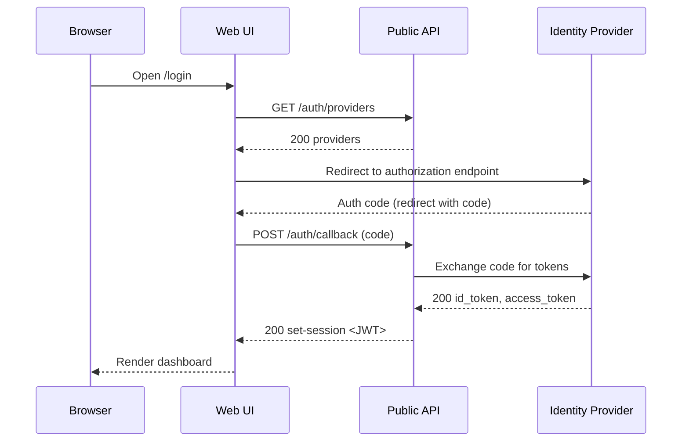

## Purpose
Define a precise, AI- and human-friendly convention for documenting **Runtime Interaction Sequences** (ARCH-06). The convention standardizes file naming, content structure, diagram syntax, editing operations, and validation rules so the document can be generated, read, and verified deterministically.

## Applicability
This convention applies to the documentation item **ARCH-06 — Runtime interaction sequences**. It governs the single product‑level document that explains runtime behavior through narrative text and sequence diagrams.

## File Location and Naming
- **Document ID:** `ARCH-06`
- **No versioning inside the file** (version is managed via VCS).
- **Character set:** UTF‑8; **Line endings:** `\n`.

## Roles and Responsibilities
- **Authoring:** AI tools MAY draft; human reviewers SHOULD validate correctness and clarity.
- **Editing:** AI tools MAY edit only when `edit_allowed=Y` in `references.md`. Otherwise human‑only edits.
- **Approval:** Product’s technical owner or delegate SHOULD approve material changes.

## Document Structure (normative)
The ARCH‑06 document MUST follow the section order below. Sections marked **[C]** are critical and MUST exist; **[H]** are highly recommended; **[R]** are recommended.
1. **Overview [C]** — short purpose, scope, and when to read this document.
2. **Runtime Scenarios Catalog [C]** — register table of all scenarios with stable IDs.
3. **Global Assumptions & Constraints [H]** — cross‑cutting rules affecting all scenarios.
4. **Sequence Scenarios [C]** — one subsection per scenario, each containing:
   - **Scenario Header [C]** — ID, name, intent, primary actors, preconditions, triggers.
   - **Happy Path Diagram [C]** — main sequence diagram.
   - **Happy Path Narrative [C]** — stepwise explanation aligned to the diagram.
   - **Alternates & Exceptions [H]** — numbered alternates; each with diagram or annotated steps.
   - **Data/State Notes [H]** — created/updated entities, invariants, idempotency, retries.
   - **Non‑Functional Considerations [R]** — latency, throughput, scalability, cost, security notes.
   - **Observability Hooks [H]** — logs/metrics/traces emitted at key steps.
5. **Cross‑Scenario Interactions [H]** — references among scenarios, shared fragments.
6. **Glossary [R]** — scenario‑specific terms not covered by global glossary.
7. **Change Log [H]** — brief chronological list of substantive content updates (no document metadata header).

## Scenario ID and Naming Rules (normative)
- **Scenario ID format:** `SEQ-XXX` where `XXX` is a zero‑padded integer (`001`, `002`, …).
- **Scenario Name:** concise, imperative phrase (≤ 8 words), e.g., “Authenticate user via SSO”.
- **Stability:** IDs are stable across edits; do not reuse or renumber removed IDs (mark as deprecated).

## Sequence Diagram Syntax (normative)
- **Syntax:** Mermaid sequence diagrams (`mermaid` fenced blocks).
- **Participants:** declare in appearance order; use stable aliases with readable labels, e.g., `participant API as Public API`.
- **Styling:** default Mermaid styling; avoid tool‑specific extensions.
- **Message Notation:**
  - Synchronous call: `->>`
  - Asynchronous/event: `-)`
  - Response/return: `-->>`
  - Notes: `Note over <actors>: …`
  - Optional/loop/alt blocks: use `opt`, `loop`, `alt`/`else` sections with clear guards.
- **Lifelines:** prefer explicit `activate`/`deactivate` for long operations.
- **Privacy:** do not include secrets, tokens, or PII values; use placeholders (e.g., `<JWT>`, `<user_id>`).
- **Determinism:** message labels MUST map 1:1 to the steps in the scenario narrative.

## Narrative–Diagram Alignment (normative)
- Each diagram step MUST have a corresponding numbered narrative step.
- Narrative step labels use the form `[n] <actor>: <action>`. The message text SHOULD match the diagram label verbatim.
- Alternate/exception flows use composite numbering: `[A1.1]`, `[E2.3]`, etc., and MUST indicate the diverging guard.

## Required Tables (normative)
### Runtime Scenarios Catalog
Columns: `scenario_id`, `name`, `primary_actors`, `summary`, `status`
- `status` ∈ { `Active`, `Deprecated` }.
- The table MUST include all `SEQ-XXX` scenarios present in the document.

### Data/State Impact Table (per scenario) [H]
Columns: `entity`, `operation`, `when(step)`, `idempotent(Y/N)`, `notes`

## Writing Style Rules
- Use short sentences and active voice.
- Avoid domain‑specific jargon unless defined in Glossary.
- Keep each scenario’s main narrative ≤ 25 steps where feasible; split into sub‑scenarios if longer.
- Use consistent tense: present simple for behavior, present perfect for state after completion.

## Validation Rules (normative)
Automations and reviewers MUST validate:
1. **Structure:** All mandatory sections exist and follow order.
2. **Catalog Consistency:** Every `SEQ-XXX` referenced in text has a scenario section and catalog entry.
3. **Alignment:** Diagram messages == narrative steps (string‑equal ignoring ASCII case and spacing around punctuation).
4. **Mermaid Blocks:** At least one valid `mermaid` sequence block per scenario’s happy path.
5. **IDs:** `SEQ-XXX` IDs unique and never reused.
6. **Links:** Cross‑references resolve to existing scenario headers.
7. **Security Hygiene:** No secrets/PII in examples.
8. **Observability Hooks:** For critical steps (authentication, write operations, external calls) there is at least one log/metric/trace reference.

## Editing & Lifecycle (normative)
- **Add Scenario:** Allocate next `SEQ-XXX`; add row to Catalog; create scenario section with required subsections.
- **Modify Scenario:** Update diagram and narrative together; ensure Catalog remains consistent.
- **Deprecate Scenario:** Keep section; set `status=Deprecated`; add rationale in Change Log; keep diagram for historical reference.
- **Remove Scenario:** Avoid removal; prefer deprecation. If removal is unavoidable, keep the Catalog row with `status=Deprecated` and a note.

## Minimal Example (illustrative)
> Note: Replace placeholders with actual actors and messages. Keep alignment rules.

**Catalog (excerpt)**

| scenario_id | name                         | primary_actors           | summary                                   | status  |
|-------------|------------------------------|--------------------------|-------------------------------------------|---------|
| SEQ-001     | Authenticate user via SSO    | Browser, API, IdP        | Browser initiates SSO; token issued to UI | Active  |

**Scenario SEQ-001 — Authenticate user via SSO**

**Happy Path Diagram**

**Happy Path Narrative**
1. [1] Browser: open `/login`.
2. [2] Web UI: request available providers.
3. [3] Public API: return configured providers.
4. [4] Web UI: redirect the user to the Identity Provider authorization endpoint.
5. [5] Identity Provider: return authorization code to Web UI (via redirect).
6. [6] Web UI: post authorization code to Public API callback.
7. [7] Public API: exchange code for tokens with the Identity Provider.
8. [8] Identity Provider: return tokens to Public API.
9. [9] Public API: establish session and return `<JWT>` to Web UI.
10. [10] Web UI: render dashboard to Browser.

**Alternates & Exceptions**
- [A1.1] If provider discovery fails, UI shows retry and logs `auth.providers.fetch.error`.
- [E2.3] If token exchange fails, API returns `401` with error code `auth.exchange.failed`.

**Data/State Notes**
| entity       | operation | when(step) | idempotent(Y/N) | notes                         |
|--------------|-----------|------------|------------------|-------------------------------|
| session      | create    | [9]        | Y                | overwrite if already present  |
| audit_event  | write     | [2],[7],[9]| Y                | use structured logging        |

**Observability Hooks**
- Logs: `auth.providers.fetch`, `auth.exchange.request`, `auth.session.created`
- Metrics: `auth.login.latency_ms`, `auth.login.error_rate`
- Traces: link UI ↔ API ↔ IdP spans via `trace_id`

## Cross‑Scenario Interactions [H]
- SEQ-001 is prerequisite for “Submit order” scenario (e.g., `SEQ-005`).

## Glossary [R]
- **Happy path:** The most common successful flow without errors.
- **IdP:** Identity Provider issuing tokens and asserting identity.
- **Actor:** A participant (system or user agent) in a sequence.

## Change Log [H]
- YYYY‑MM‑DD: Initial publication of ARCH‑06 convention and example.
