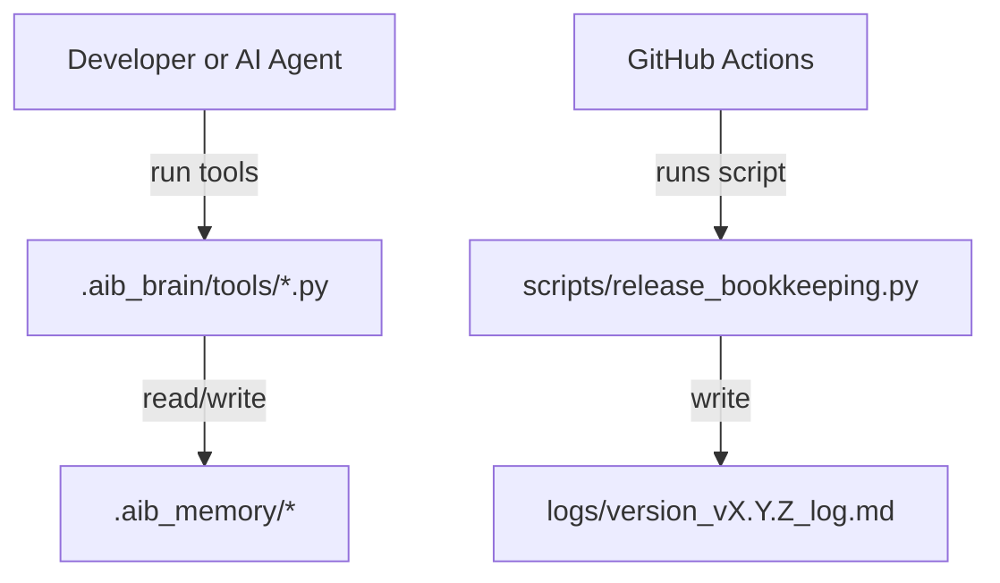

# Overview

This catalog describes the core business processes supported by AI Builder (AIB) in this repository. A business process here is an end-to-end workflow that produces an auditable artifact (requests, iterations, documentation, release logs).

# Catalog Schema

See the governing convention for required fields.

# Process Entries

#### BP-0001 — Initialize AIB workspace
- **description:**
	Establishes `.aib_memory` and seeds default registers and product-doc stubs.
- **triggers:**
	- A workspace is missing `.aib_memory`.
- **inputs:**
	- `.aib_brain` assets
- **outputs:**
	- `.aib_memory/references.md`
	- `.aib_memory/requests_register.md`
	- `.aib_memory/docs/*` stubs
- **steps:**
	1. Run initialize from workspace root.
	2. Create `.aib_memory` structure.
	3. Seed registers and docs.
	4. Validate baseline files exist.
- **roles:**
	- Developer (R)
	- AIB Maintainers (C)
- **dependencies:**
	- BP-0002
- **policies:**
	- Deterministic, workspace-relative writes.
- **metrics:**
	- Init succeeds without partial writes (Owner: AIB Maintainers)
- **systems:**
	- Local terminal
- **frequency:** ad-hoc
- **owner_role:** AIB Maintainers
- **notes:**
	Idempotent after first successful seed.

#### BP-0002 — Create request
- **description:**
	Opens a single Active request and seeds request artifacts including default iteration 01.
- **triggers:**
	- New work starts.
- **inputs:**
	- Request title
- **outputs:**
	- New request folder under `.aib_memory/requests/`
	- Updated `requests_register.md`
- **steps:**
	1. Validate no other Active request.
	2. Create request folder and seed files.
	3. Register request as Active.
- **roles:**
	- Developer (R)
	- Product Owner (A)
- **dependencies:**
	- BP-0001
- **policies:**
	- Only one Active request per workspace.
- **metrics:**
	- Register row created correctly (Owner: Product Team)
- **systems:**
	- Local terminal
- **frequency:** ad-hoc
- **owner_role:** Product Team
- **notes:**
	Folder naming includes request id and title slug.

#### BP-0003 — Create iteration
- **description:**
	Creates a new iteration for the Active request; enforces single Active iteration.
- **triggers:**
	- Additional clarification or follow-up work.
- **inputs:**
	- Iteration summary
- **outputs:**
	- Updated `iterations.md`
- **steps:**
	1. Validate Active request exists.
	2. Append next iteration id.
	3. Set new iteration Active.
- **roles:**
	- Developer (R)
- **dependencies:**
	- BP-0002
- **policies:**
	- Only one Active iteration per request.
- **metrics:**
	- Strictly increasing ids (Owner: AIB Maintainers)
- **systems:**
	- Local terminal
- **frequency:** ad-hoc
- **owner_role:** Product Team
- **notes:**
	Higher iteration id wins on conflicts.

#### BP-0004 — Execute implement workflow
- **description:**
	Applies request scope, updates allowed docs/code, and appends implementation evidence.
- **triggers:**
	- Plan is ready.
- **inputs:**
	- Active request scope
	- References register
- **outputs:**
	- Updated product docs where edit_allowed=Y
	- Updated request implementation log
- **steps:**
	1. Resolve Active request and iteration.
	2. Read required references and conventions.
	3. Apply changes only to allowed files.
	4. Run validations.
	5. Append implementation log.
- **roles:**
	- AI Agent (R)
	- Developer (A)
- **dependencies:**
	- BP-0002
- **policies:**
	- Never write to edit_allowed=N.
- **metrics:**
	- forbidden_writes_count = 0 (Owner: Product Team)
- **systems:**
	- VS Code
- **frequency:** ad-hoc
- **owner_role:** Product Team
- **notes:**
	Convention enforcement fails closed.

#### BP-0005 — Automated release bookkeeping
- **description:**
	Bumps patch marker and creates per-version log during PR workflows.
- **triggers:**
	- PR opened/reopened/synchronized.
- **inputs:**
	- Base ref marker
	- Optional commit subject list
- **outputs:**
	- Rotated SemVer marker
	- New `logs/version_vX.Y.Z_log.md`
- **steps:**
	1. Validate single marker.
	2. Compute patch+1.
	3. Rotate marker and write log.
	4. Push commit to PR branch.
- **roles:**
	- GitHub Actions (R)
	- AIB Maintainers (A)
- **dependencies:**
	- BP-0001
- **policies:**
	- Do not modify existing logs.
- **metrics:**
	- Workflow idempotent on reruns (Owner: AIB Maintainers)
- **systems:**
	- GitHub Actions
- **frequency:** ad-hoc
- **owner_role:** AIB Maintainers
- **notes:**
	Idempotent completion when marker/log already present.

# Diagrams (Optional)

# Cross-Mappings

- terms:
	- TERM-0001 - AI Builder
	- TERM-0005 - Request
	- TERM-0006 - Iteration
- use_cases:
	- UC-001 - Initialize workspace
	- UC-004 - Implement request scope
- personas:
	- DEVELOPER - Repository developer
	- AI_AGENT - Automation agent
- data_products:
	- DS-0001 - AIB_Requests_Register
- dashboards:
	- None

# Governance & Maintenance

- Stewardship: AIB Maintainers.
- Update triggers: changes to tools/prompts/conventions or lifecycle rules.
- Review cadence: quarterly.

# Change Log

| date (YYYY-MM-DD) | change_type | process_ids | summary | editor |
| --- | --- | --- | --- | --- |
| 2026-03-22 | updated | BP-0001..BP-0005 | Populated initial AIB process catalog | AI Agent |
