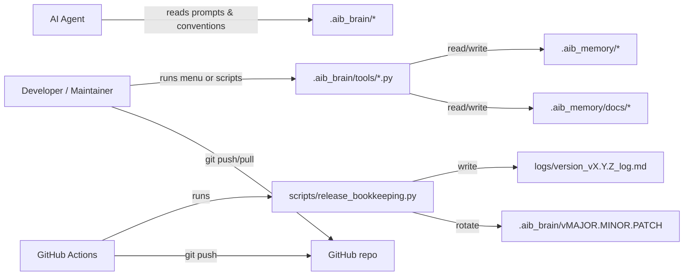

## Summary

AI Builder (AIB) is a file-first, deterministic workflow framework implemented as reusable “brain” assets plus workspace-specific “memory” artifacts. It standardizes request/iteration lifecycle, documentation governance via conventions, and optional CI release bookkeeping.

Architecture-in-a-sentence: A user or agent runs Python tools that read and write a controlled set of Markdown files under `.aib_memory`, with optional CI automation for version/log bookkeeping.

## System Context

External actors/systems:
- Developer workstation (local terminal + editor)
- AI agent interface (e.g., VS Code Copilot)
- GitHub (repository hosting)
- GitHub Actions (CI runner)

## Component Inventory (required table)

| Component name | Description | Purpose | Location (runtime/execution location or repo/subsystem) | Group or category | Component tier | Connections and dependencies (comma-separated component names) |
| --- | --- | --- | --- | --- | --- | --- |
| AIB Brain Assets | Prompts, conventions, templates, tool scripts | Deterministic workflows and doc conventions | Repo: `.aib_brain/` | Orchestration | Application | AIB Tool Scripts, AIB Command Menu |
| AIB Command Menu | Terminal UI launcher for tool scripts; surfaces only non-excluded scripts (EXCLUDE_SCRIPTS); streams subprocess stdout/stderr to terminal in real time via Popen tee pattern; writes per-action log files to `logs/aib-action-<timestamp>-<action-id>.log` | Human-friendly access to tool scripts | Repo: `.aib_brain/run.bat`, `.aib_brain/run.sh`, `.aib_brain/tools/menu.py` | UI | Presentation | AIB Tool Scripts |
| AIB Tool Scripts | Python scripts for lifecycle actions | Deterministic creation/update of memory artifacts | Repo: `.aib_brain/tools/*.py` | Orchestration | Application | AIB Brain Assets, AIB Memory Artifacts |
| AIB Memory Artifacts | Requests, registers, product docs | Persist state and documentation | Repo: `.aib_memory/` | Storage | Data | AIB Tool Scripts |
| Release Bookkeeping Script | Patch bump + version log generation | Automate PR bookkeeping | Repo: `scripts/release_bookkeeping.py` | Operations | Application | GitHub Actions Workflow, SemVer Marker, Logs |
| GitHub Actions Workflow | CI workflow calling bookkeeping | Automate bump + log | Repo: `.github/workflows/aib-semver-patch-bump-and-log.yml` | Operations | Infrastructure | Release Bookkeeping Script |
| Logs | Release log files | Audit and traceability | Repo: `logs/` | Observability | Data | Release Bookkeeping Script |

## Data Flows

- Developer/Agent → Tool Scripts (local execution; Python; ad-hoc)
- Tool Scripts → `.aib_memory` registers and request artifacts (file write; Markdown)
- Tool Scripts → `.aib_memory/docs` product docs (file write; Markdown)
- GitHub Actions → Release bookkeeping (process invocation; Python)
- Release bookkeeping → `.aib_brain` marker rotation and `logs/` log creation (file write)

## Environments & Topology (high-level)

- Local development: workstation runs tool scripts and edits artifacts.
- CI: GitHub Actions runner executes release bookkeeping and pushes to PR branch.

## Quality Attributes (overview)

- Scalability: file-based artifacts scale; prompts must chunk reads for large repos.
- Reliability: deterministic scripts fail fast on invalid states.
- Security: writes gated by references register; see SEC-01.
- Observability: release logs and implementation logs provide traceability; see OBS-01.

## Assumptions & Constraints (summary)

- Exactly one Active request per workspace.
- Convention mapping must exist; missing mapping fails closed.

## Key Risks & Mitigations

- Large workspaces exceed context; mitigate via inventory + chunked reads.
- Convention drift breaks parsing; mitigate via authoritative mapping + fail-closed.

## Traceability

| Artifact type | ID | Short note |
| --- | --- | --- |
| Requirement | RQT-02 | Requirements for AIB workflows |
| Domain | KNW-03 | Personas and use cases |
| Compute | CMP-01 | Tool scripts inventory |
| Operations | OBS-01 | Logging policy |

## Change Log (lightweight)

- 2026-03-22: Populated ARCH-01 for this workspace — R-20260322-0845 / Iteration 01
- 2026-04-03: Updated AIB Command Menu Description to reflect copilot CLI gating, EXCLUDE_SCRIPTS, and static informational block — R-20260403-0939 / Iteration 04
- 2026-04-03: Updated AIB Command Menu with real-time streaming, per-action log files, and stdin passthrough — R-20260403-1651 / Iteration 01
- 2026-04-05: Removed Copilot CLI detection and prompt action gating from AIB Command Menu description — R-20260404-2326 / Iteration 01
