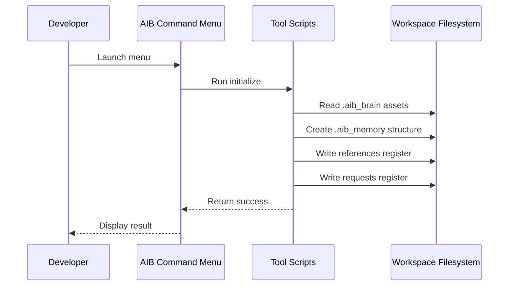
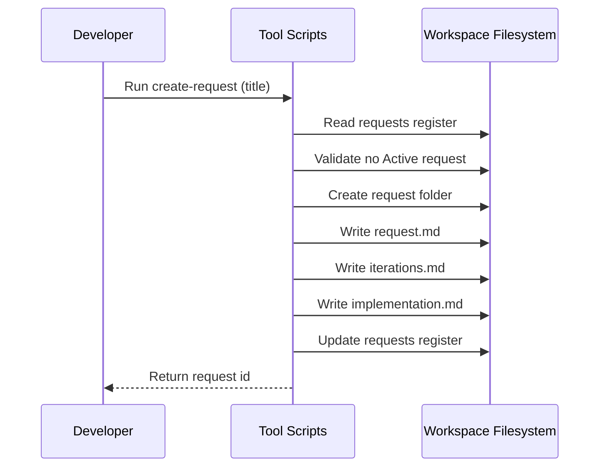
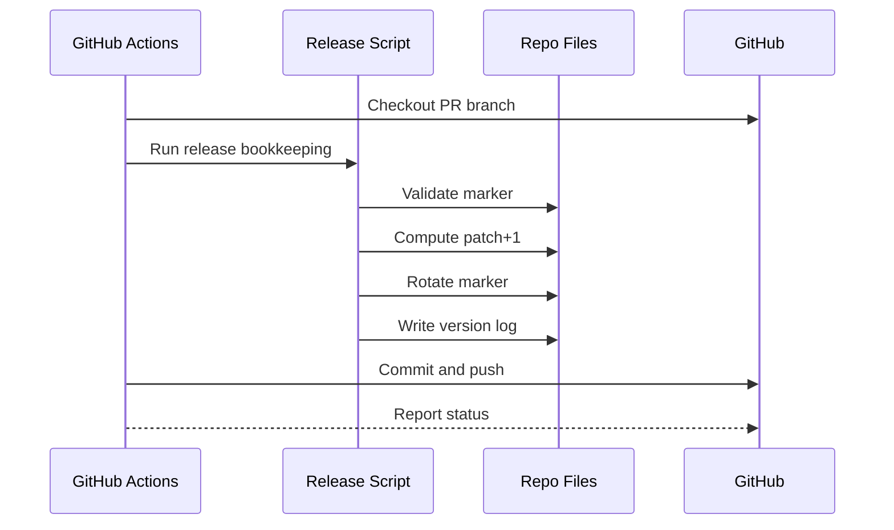
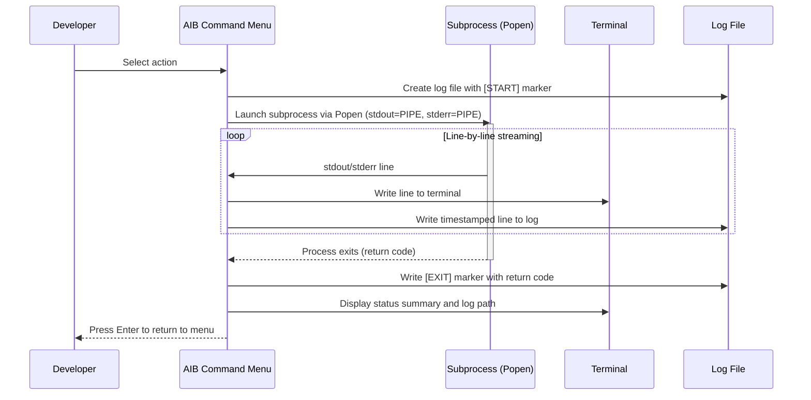

# Overview

This document describes runtime interaction sequences for AIB workflows in this repository. Sequences are file-first and revolve around deterministic reads/writes of `.aib_memory` artifacts.

# Runtime Scenarios Catalog

| scenario_id | name | primary_actors | summary | status |
| --- | --- | --- | --- | --- |
| SEQ-001 | Initialize workspace | Developer, Tool Scripts | Seed `.aib_memory` registers and doc stubs | Active |
| SEQ-002 | Create request | Developer, Tool Scripts | Create request folder and register Active request/iteration | Active |
| SEQ-003 | Release bookkeeping in CI | GitHub Actions, Release Script, GitHub | Bump patch marker and generate per-version log | Active |
| SEQ-004 | Execute action with real-time streaming | Developer, AIB Command Menu, Subprocess | Run script or prompt action with Popen tee pattern, stream output, write log file | Active |

# Global Assumptions & Constraints

- Tool scripts run from workspace root.
- Exactly one Active request per workspace.
- Writes are gated by references and conventions.

# Sequence Scenarios

## Scenario SEQ-001 — Initialize workspace

**Scenario Header**
- ID: SEQ-001
- Intent: Seed `.aib_memory` with registers and default product-doc stubs.
- Primary actors: Developer, Tool Scripts
- Preconditions: `.aib_brain` exists; Python available.
- Triggers: Workspace missing `.aib_memory`.

**Happy Path Diagram**

**Happy Path Narrative**
1. [1] Developer: launch menu.
2. [2] AIB Command Menu: run initialize.
3. [3] Tool Scripts: read .aib_brain assets.
4. [4] Tool Scripts: create .aib_memory structure.
5. [5] Tool Scripts: write references register.
6. [6] Tool Scripts: write requests register.
7. [7] Tool Scripts: return success.
8. [8] AIB Command Menu: display result.

**Alternates & Exceptions**
- [E1.1] If `.aib_brain` missing, fail with no writes.

**Data/State Notes**
| entity | operation | when(step) | idempotent(Y/N) | notes |
| --- | --- | --- | --- | --- |
| memory_structure | create | [4] | Y | Folder creation is idempotent. |
| references_register | write | [5] | Y | Deterministic seed. |

**Observability Hooks**
- Logs: initialize.start, initialize.completed, initialize.error

## Scenario SEQ-002 — Create request

**Scenario Header**
- ID: SEQ-002
- Intent: Create Active request and seed artifacts.
- Primary actors: Developer, Tool Scripts
- Preconditions: `.aib_memory` exists; no other Active request.
- Triggers: New work item.

**Happy Path Diagram**

**Happy Path Narrative**
1. [1] Developer: run create-request.
2. [2] Tool Scripts: read requests register.
3. [3] Tool Scripts: validate no Active request.
4. [4] Tool Scripts: create request folder.
5. [5] Tool Scripts: write request.md.
6. [6] Tool Scripts: write iterations.md.
7. [7] Tool Scripts: write implementation.md.
8. [8] Tool Scripts: update requests register.
9. [9] Tool Scripts: return request id.

**Alternates & Exceptions**
- [E2.1] If another request is Active, fail with no writes.

**Observability Hooks**
- Logs: request.create.start, request.create.completed, request.create.validation_failed

## Scenario SEQ-003 — Release bookkeeping in CI

**Scenario Header**
- ID: SEQ-003
- Intent: Bump patch marker and create per-version log.
- Primary actors: GitHub Actions, Release Script, GitHub
- Preconditions: single marker file exists.
- Triggers: PR event.

**Happy Path Diagram**

**Happy Path Narrative**
1. [1] GitHub Actions: checkout PR branch.
2. [2] GitHub Actions: run release bookkeeping.
3. [3] Release Script: validate marker.
4. [4] Release Script: compute patch+1.
5. [5] Release Script: rotate marker.
6. [6] Release Script: write version log.
7. [7] GitHub Actions: commit and push.
8. [8] GitHub Actions: report status.

**Alternates & Exceptions**
- [E3.1] Marker invalid -> fail; do not write partial changes.

**Observability Hooks**
- Logs: ci.release_bookkeeping.start, ci.release_bookkeeping.error
## Scenario SEQ-004 — Execute action with real-time streaming

**Scenario Header**
- ID: SEQ-004
- Intent: Run a script or prompt action from the menu with real-time stdout/stderr streaming to the terminal and a persistent per-action log file.
- Primary actors: Developer, AIB Command Menu, Subprocess
- Preconditions: Menu is running; action is selected.
- Triggers: Developer selects a script action or prompt action from the menu.

**Happy Path Diagram**

**Happy Path Narrative**
1. [1] Developer: select action from menu.
2. [2] AIB Command Menu: create log file at `logs/aib-action-<timestamp>-<action-id>.log` with `[START]` marker.
3. [3] AIB Command Menu: launch subprocess via `subprocess.Popen` with `stdout=PIPE`, `stderr=PIPE`, and `stdin=None` (inherited) for prompt actions or `stdin=DEVNULL` for script actions.
4. [4] Subprocess: produce stdout/stderr lines.
5. [5] AIB Command Menu: stream each line to terminal and log file via daemon threads.
6. [6] Subprocess: exit with return code.
7. [7] AIB Command Menu: write `[EXIT]` marker with return code to log file.
8. [8] AIB Command Menu: display status (Success or Failed with exit code) and log file path.
9. [9] Developer: press Enter to return to menu.

**Alternates & Exceptions**
- [E4.1] If subprocess fails immediately (e.g., command not found), exit code is captured and displayed; log file contains `[START]`, `[ERR]`, and `[EXIT]` markers.
- [A4.1] For prompt actions, if copilot CLI prompts for user input, stdin is inherited so the developer can respond.

**Data/State Notes**
| entity | operation | when(step) | idempotent(Y/N) | notes |
| --- | --- | --- | --- | --- |
| log_file | create | [2] | N | New file per action execution |
| log_file | append | [5],[7] | Y | Append-only writes |

**Observability Hooks**
- Logs: action.start, action.output, action.exit
# Cross‑Scenario Interactions

- SEQ-001 is prerequisite for request workflows.
- SEQ-003 is independent of SEQ-001/SEQ-002.

# Glossary

- Idempotent: repeated run produces same end state.

# Change Log

- 2026-03-22: Populated runtime sequences — R-20260322-0845 / Iteration 01
- 2026-04-03: Added SEQ-004 for action execution with real-time streaming and logging — R-20260403-1651 / Iteration 01
