# Overview

This file describes how the AI Builder (AIB) framework should be used within a software development team.

# Definitions

**Actor:** a participant in the process. Actors are numbered with indexes 01, 02, ... (for example "Actor 03"); different indexes may represent different people.

**analysis prompt** — a prompt from AIB that starts generation of the Analysis and Questionnaire files for the current iteration.

**plan prompt** — a prompt from AIB that starts generation of the Plan file for the current request.

**implementation prompt** — a prompt from AIB that starts realization of the planned actions according to the Request and Plan files.

**generate documentation prompt** — a prompt from AIB that updates the documentation in memory according to the new request implementation.

**test generation prompt** — a prompt from AIB to generate tests that are independent of the implementation (planned for future use).

**maintenance prompt** — (not existing yet) a prompt from AIB that optimizes code, runs tests, monitors logs, generates warnings, runs health checks, and tunes the application based on actual data. These are changes that do not require creation of a new User Story but are part of regular operational routines.

# Process

## Process Diagram

```mermaid
flowchart TD
    subgraph USD["User Story Definition (no AIB)"]
        A1(["Human defines User Story in Product Backlog"])
    end

    subgraph S1["Stage 1: Requirements Clarification"]
        B1["Communicate with requestor and team members"]
        B2["AI chat assists: gap analysis, AC, constraints, domain knowledge"]
    end

    subgraph S2["Stage 2: AIB Analysis Actor 01 - Senior Developer"]
        C1["2.1 Create AIB request User Story becomes Requirements file"]
        C2["2.2 Run analysis prompt Generate Analysis & Questionnaire"]
        C3["2.3 Examine analysis, modify request, answer questionnaire"]
        C4{"2.4 Significant changes needed?"}
        C5["Create next iteration"]
        C6["2.5 Run plan prompt Examine generated Plan"]
        C7{"Plan acceptable?"}
        C8["2.6 Inform team & Actor 02 Ready for Implementation"]
        C9["2.7 Log issue in AIB repo"]
    end

    subgraph S3["Stage 3: Implementation Actor 02 - Any Team Member"]
        D1["3.1 Run implementation prompt Copilot generates deliverables, creates & runs tests (100% pass required)"]
        D2["3.2 Manual examination of results"]
        D3{"Errors or deviation found?"}
        D4["3.4 Inform team & Actor 03 Ready for Independent Testing"]
    end

    subgraph S4["Stage 4: Independent Testing Actor 03 - Basic Technical Member"]
        E1["4.1 Run test generation prompt (independent of implementation)"]
        E2{"4.2 Tests successful?"}
        E3["4.3 Run generate documentation prompt"]
        E4{"4.4 Documentation correct?"}
        E5["Log issue in AIB repo Manually fix docs with AI assistance"]
        E6["Inform team & Actor 01 Ready for Closing"]
    end

    subgraph S5["Stage 5: Closing Request Actor 01 - Senior Developer"]
        F1["Validate documentation, tests & process"]
        F2{"Issues detected?"}
        F3(["Close request & commit changes"])
    end

    subgraph S6["Stage 6: Maintenance Actor 04 - Any Team Member"]
        G1["Regularly run maintenance prompt"]
        G2{"Execution errors?"}
        G3["Log issue in AIB repo"]
    end

    %% Main sequential flow
    A1 --> B1 --> B2 --> C1
    C1 --> C2 --> C3 --> C4
    C4 -->|Yes| C5 --> C2
    C4 -->|No| C6 --> C7
    C7 -->|No - refine| C5
    C7 -->|Yes| C8 --> D1
    D1 --> D2 --> D3
    D3 -->|No| D4 --> E1
    E1 --> E2
    E2 -->|Yes| E3 --> E4
    E4 -->|No| E5 --> E6
    E4 -->|Yes| E6
    E6 --> F1
    F1 --> F2
    F2 -->|No issues| F3 --> G1
    G1 --> G2
    G2 -->|Yes| G3 --> G1
    G2 -->|No| G1

    %% Feedback and escalation loops
    D3 -->|Yes - 3.3 inform Actor 01| C1
    E2 -->|No - inform Actor 01| C1
    F2 -->|Yes - return to Stage 2| C1

    %% AIB issue reporting side path
    C3 -.->|Unexpected AIB behavior| C9
```

## Stages

### User Story Definition

The User Story is defined in the product backlog based on initial user requirements. There is no AIB usage in this step, but a human from the team defines manually the User Story.

### 1 Requirements Clarification

At this stage, a human communicates with the requestor and/or other experts or team members to achieve a detailed and precise definition of the User Story. A human can be assisted by AI (usually in chat mode) with predefined prompts that help find gaps or contradictions in the User Story definition, define Acceptance Criteria, identify constraints, clarify business intent, gather domain knowledge, and collect supporting materials.

### 2 AIB Analysis

Actor 01: A Senior Developer with extended domain and technical knowledge

#### Step 2.1 

Actor 01 creates a new request in AIB. The User Story definition becomes the first version of the requirements file in the created AIB request.

#### Step 2.2

In the first iteration, Actor 01 executes the "analysis prompt" of AIB to generate the initial Analysis and Questionnaire files.

#### Step 2.3

Actor 01 examines the analysis in detail and modifies it and/or the request text as needed. They also answer the questions in the questionnaire.

#### Step 2.4 

If the changes to the request are significant, Actor 01 creates the next iteration and the process repeats until the request reaches the required quality and addresses all aspects found missing or erroneous during the analysis.

#### Step 2.5

Actor 01 generates the Plan by executing the "plan prompt." Actor 01 reviews the plan and, if needed, returns to Step 2.4 to create a new analysis iteration and refine the request. After each change to the Analysis or Request, Actor 01 should generate a new Plan.

#### Step 2.6

When Actor 01 decides the Plan meets expectations, they inform the team and Actor 02 that the next stage can begin.

#### Step 2.7

If Actor 01 detects unexpected behavior of AIB, they shall create an issue in the AIB repo.

### 3 Implementation

Actor 02: Any member of the team (even without technical background) can perform this stage

#### Step 3.1

Actor 02 runs the "implementation prompt" and follows Copilot's instructions if needed. The outcome of this step should be that Copilot generates the expected deliverables, creates or supplements tests, runs all available tests, and ensures 100% test success.

#### Step 3.2

Actor 02 examines the result manually in addition to the test runs.

#### Step 3.3

If manual testing reveals errors or deviations from expected results, Actor 01 is informed to revise and modify the request, analysis, and plan.

#### Step 3.4

If manual testing shows no deviations, Actor 02 informs the team and Actor 03 to continue with Stage 4.

### 4 Independent Testing

Actor 03: A team member who is with basic technical knowledge

#### Step 4.1

Actor 03 executes a "test generation prompt" independently from the "implementation prompt", based on the requirements file and any additional team-defined quality requirements.

#### Step 4.2

If the tests are not successful, Actor 3 informs Actor 01 and the process returns to Stage 2.

#### Step 4.3

If the tests are successful, Actor 03 executes the "generate documentation prompt." 

#### Step 4.4

Actor 03 reviews the documentation changes. If there are errors or deviations, they create an issue in the AIB repo so the AIB team can troubleshoot the case. Documentation fixes are applied manually with AI assistance and do not require a new implementation cycle.

### 5 Closing Request

Actor 01 should review the outcomes from the previous steps (without reading the code in detail), validate the documentation, tests, and process, and if there are no issues, close the request and commit the changes.

### 6 Maintenance

Actor 04: Any member of the team (even without technical background) can perform this stage

Regularly, Actor 04 executes the "maintenance prompt." If errors occur while executing the prompt, they create an issue in the AIB repo for the AIB team to troubleshoot.